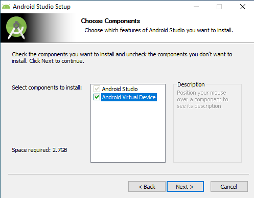
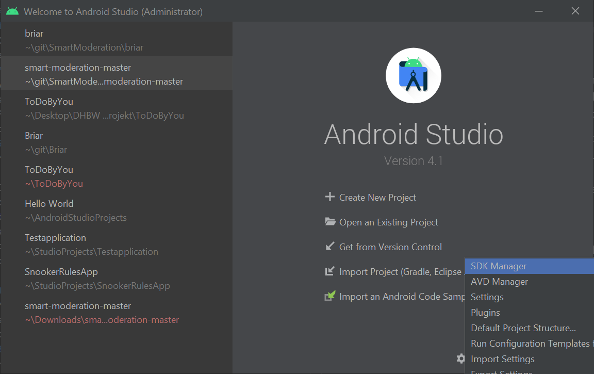
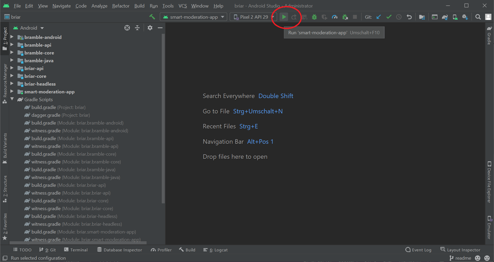

# SmartModeration

SmartModeration is an app for Android devices that supports consensus-based decision-making. It has various functionalities, e.g. 
* Add contacts via scanning a QR code 
* Create groups
* Create meetings
* Create consensus proposals 
* Evaluate a consensus proposal and show the results of the evaluation
* Display these results in a browser with the help of a webserver

## Getting started

This installation guide is for Windows 10 and for any Android device with an API level of 23 or higher.

### Install Android Studio

Download [Android Studio](https://developer.android.com/studio/ "Android Studio Home") and install it.  
Make sure to select the option "Android virtual device" if you want to test the software on an emulated device later. 
  

### Get the source code
If you are reading this README than you probably have access to the source code. You can download the lastest version [here](https://github.com/Danil-Terehov/SmartModeration "Github SmartModeration"). 

### Open the project in Android Studio 
Open Android Studio and click on "Open an existing project" and make sure to select **SmartModeration/Briar** as your project.   
When you open the project Android Studio should automatically start the process "Sync Project with Gradle Files". Sometimes this fails. In this case you can also start this process by yourself by clicking **File -> Sync Project with Gradle Files** in the top menu. 

It's possible that an error occurs during this process. Typically, the error is associated with the Gradle task "Could not create task ':smart-moderation-app:minifyOfficialReleaseWithR8'. This is a type of misleading error. In this case you are likely missing Android SKD 29, because Android Studio only installs SKD 30 by default. 

#### Installing Android SDK
You need to open the SKD Manager and install SDK 29. You can open the SDK Manager by clicking **Tools -> SDK Manager** or **File -> Settings -> Appearance & Behaviour -> System Settings -> Android SDK**. Here you can select the necessarry SDK and download it. You can also open the SDK Manager without an open project. In the start screen you can hover over **configure** and select sdk manager from the menu.

## Run on emulated device
To create an emulated device you need to open the AVD Manager with (**Tools -> AVD Manager**). Here you can click **Create Virtual Device**. In the upcomming window you can select your Android machine, e.g. **Phone - Pixel 2**. After that, you have to specify the SDK version of the device. For SmartModeration the minimum SDK version is 23, but the recommended version is 29. It is recommended not to test SmartModeration on an emulated device because a functional camera is needed for exchanging contact information via mutual scanning of QR codes. To achieve this, additional configurations would be needed, e.g. see [Use camera in Android emulator](https://stackoverflow.com/questions/2884620/using-camera-in-the-android-emulator "Use camera in Android emulator").

## Run on a real device [recommended]
To install and debug the app on a real device, you need an Android phone in developer mode. 

### Enabling developer mode
This can depend on the Android device you are using, but generally you will need to go to Settings. Here you select **About Phone** and tap the **Builder Number** 7 times. Once you've done that your phone will have developer options enabled. You will have a new option in your settings called **Developer Options**. In these settings you need to enable **USB Debugging**. Then you should be able to connect your phone to your PC via USB and see your phone show up in Android Studio as an available device. 

Once you've build the project and have an available device, you should select that device and be able to click the **Run button** in Android Studio. This will build the app, install it on the selected device and run it on that device.

## Note

Please make sure that Bluetooth is always actived on your device while using SmartModeration to guarantee a reliable communication between devices. 

